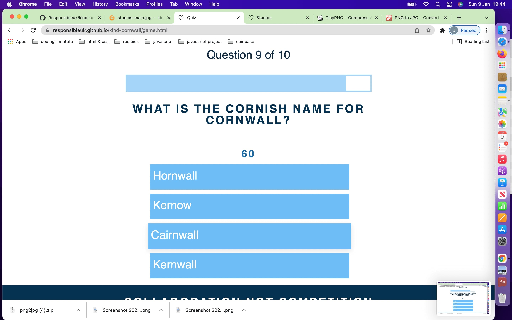

# Kind Cornwall

- 

Welcome to Kind Cornwall. We are a social enterprise that believe communities are the most sustainable, resilient and supportive networks. 

Communities evolve into the spaces around them, and are united by a common goal. Our goal is to create a thriving economy in Cornwall populated by independent creative local businesses.

Kind Cornwall is a community of Cornish business owners bonded by kindness towards people and our planet. We cultivate social spaces for sustainable change, provide business support and develop new technology helping to save the planet.

Kind Cornwall helps you shape your business, attract new customers, and progress your personal development. 

## Design

### Strategy

- Kind Cornwall is an ambitious project, we are trying to build a community for local businesses and create an activity finder, that visitors to Cornwall and Locals can use to find everything from Art Classes to Zip-line rides.

- Building an activity finder is a challenge, before you can launch you need stock i.e. experience led businesses upload there diary to the platform. Our strategy is first to build a community where local business owners can learn from each other but we will also services like web design or marketing support at very affordable prices.

### Scope
- To begin with this site is to inform and inspire people into registering their interest in joining Kind Cornwall, we have included a quiz to increase engagement with our users.
 - After launch the people that have registered will be invited to formally register and the site will be updated with a form so new visitors will be able to apply for membership.
- Members will be given access to a private slack channel, we are partnering with booking app fibodo so users that offer experience will be given free access so they can upload their diary take booking and get paid through the app.
- We will then aggregate the date and create the activity finder. This will be a new website Experience Cornwall.

### Structure

- The site will be easily navigated with a reactive Nav Bar,
- Will will use modal, and accordions so the user can access more information but the site remains text light.
- The site will include interactive quiz

### Skeleton
- Here are our original wireframes
- 
- In the build process we decided to drop the blog and we found better ways to display our content.

### Surface
- We want the site to be simple and clean, it will be predominately white and call to actions will be bright colours to get the users attention. 
- We are using a collection of circular images containing people to represent members. Or activities to represent the experience finder.
- The circular images will be a consistent design theme through the site.
- Information displayed in a way that makes the user keep reading, we will use minimal text so users can navigate the site quickly.

## User Story

- Kate runs a small yoga studio in Cornwall, she is an excellent yogi but running a small business is lonely, she is looking for a community where she bounce ideas off other business owners in Cornwall, vent frustrations find people to collaborate with other lifestyle business owners.

- Kate came across our quiz when searching on social media and she was hooked. She read went to our home page and discovered exactly what she was looking for.

- “Our strengths may be someone else’s weaknesses and this is beauty of being part of a community. Being part of a shared space, whether physical or virtual, gives people the chance to be inspired, solve problems, share humour, vent their frustrations and share their failures and successes. Welcome to Kind Cornwall.”

- She navigated through the site, and also discovered that she could get help to make her small business even better.

- She signed up, and can’t wait for the launch.

## Existing Features

- __Navigation Bar__

  - Featured on all seventeen pages, the full responsive navigation bar includes links to the Home, Community, Studios,and Inspire.
  - The navigation bar will also appear on the individual question pages for the quiz and it will appear on the registration form.
  - This section will allow the user to easily navigate from page to page across all devices without having to revert back to the previous page via the ‘back’ button.
  - This section allows users to easily see what page they are on, as the current page is highlighted. highlighted 
  - When on one of the 6 awareness pages no page will be highlighted.

- __The Footer__

  - Featured on all seventeen pages, so users have a constant call to action to register their email address.
  - The footer section includes a field for users to submit their email.
  - The footer is valuable to the user as they will be able to register for our weekly newsletter on how to be more sustainable.
  - The email address has to entered before the user can click join.

- __The landing page__

  - The landing page includes a hero image, with a countdown timer to the launch of kind cornwall.
  - A scroll down button is included, so users can easily scroll down to the next section.
  - The next section includes a description of what kind cornwall wants to achieve, with an image of peoples faces next it.
  - The section also includes a button where people can join kind cornwall.
  - Upon loading 

 - 

 - 

 - 
  
- __The community page__

  - The community page includes a hero image, with a description of our community next to a geometric heart which is part of the Kind Cornwall branding.
  - At the heart of Kind Cornwall is our member community, the feature shows images of peoples faces that represent our community, it is accompanied by a further description.
  - The final part of page contains four boxes each box contains one of the four benefits of joining our community, knowledge, connections, inspiration and support.
  - The user is able to click and a pop up will appear with more information about the relevant benefits.

  - 

  - 

  - 

- __The studios page__

  - In addition to being a community for local business owners, Kind Cornwall offers services to local businesses to help them succeed we call these studios.
  - The studios page has a hero image with a button to scroll down to the main page content.
  - The main content includes images in circles to inkeep with our branding and to the right we have expanding accordians where the user can find out more about the services we offer.

  - 

  - 

- __The game page__

  - A large part of Kind Cornwall is offering services to our community.
  - This page contains several accordians where the user can click and find out more information about what services Kind Cornwall provide"

- __The inspire page__

  - A large part of Kind Cornwall is offering inspiration to Cornish business owners.
  - The user will be able to click to generate a random inspirational quote.

  - 

- __The game page__

  - Users love interactional content, so we have included a simple multiple choice quiz about Cornwall

   - 

   - 

   - 

   - 

   - 

   - 

   - 

### Features Left to Implement

- Login for members
- Members area with details to slack channel
- Booking App Download
- Build Experience Cornwall an link

## User Stories

## Deployment

## Local Deployment

In order to make a local copy of this project, you can clone it. In your IDE Terminal, type the following command to clone my repository:

- `git clone https://github.com/Responsibleuk/kind-cornwall.git`

Alternatively, if using Gitpod, you can click below to create your own workspace using this repository.

# Credits
- __Overall theme__
 - The overall style was inspire by https://www.freecodecamp.org/news/javascript-projects-for-beginners/#how-to-create-a-review-carousel
 - inspiration was taken from https://kind.community/
 - responsive image http://ami.responsivedesign.is/
 - favicon created in Canva

- __Images__
 - The imaages have been created in canva using open source images from unsplash
 - All the images used have been stored in this folder https://unsplash.com/collections/0IDxrC-e79c/cornwall
 - Logo created in Canva

- __Code__
 - In completing this website I wartched many tutorials and read many articles on javascript. My code has been influenced from the following sources.
 - pop up modal home https://codepen.io/ptamaro/pen/YQWMEW
 - scroll down https://codepen.io/tr13ze/pen/VjLLgJ
 - Quiz https://github.com/briancodex/quiz-app-js
 - accordians on studio page https://codepen.io/kira-code/pen/vYemdLw
 - multiple modals https://stackoverflow.com/questions/40645032/creating-multiple-modals-on-a-single-page
 - Countdown launch https://www.youtube.com/watch?v=3PHXvlpOkf4&t=2644s
 - Nav bar https://www.freecodecamp.org/news/javascript-projects-for-beginners/#how-to-create-a-review-carousel

- __Content__
 - quotes https://www.shopify.co.uk/blog/motivational-quotes
 - community https://www.huffpost.com/entry/the-5-benefits-of-communi_b_10390826

