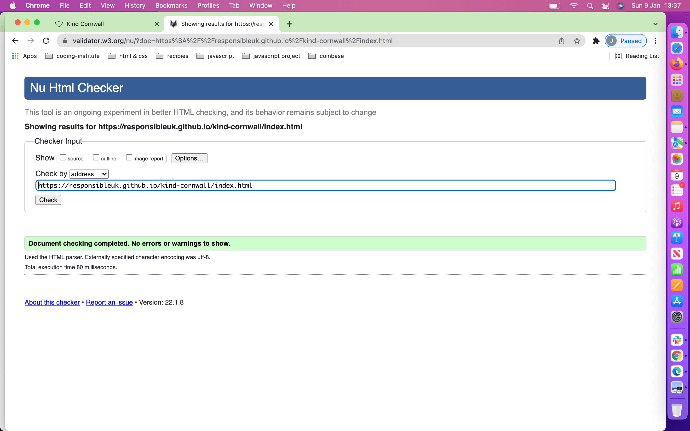
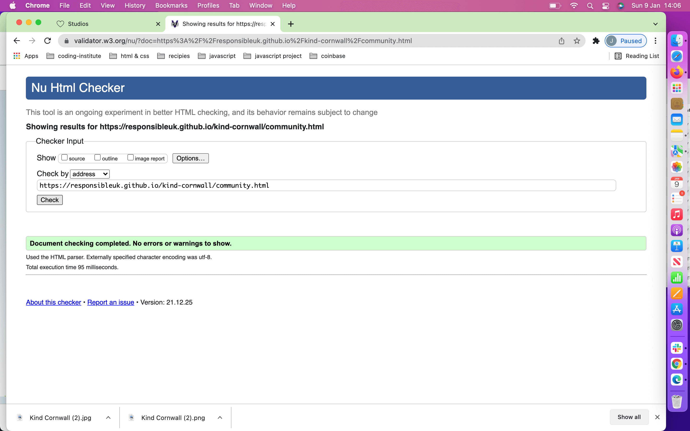
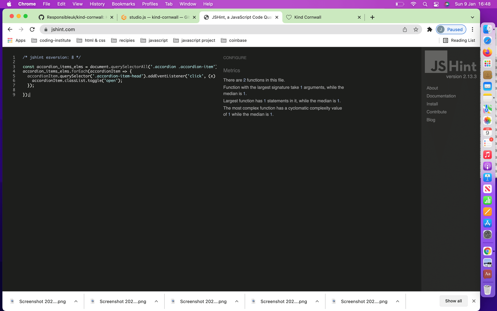
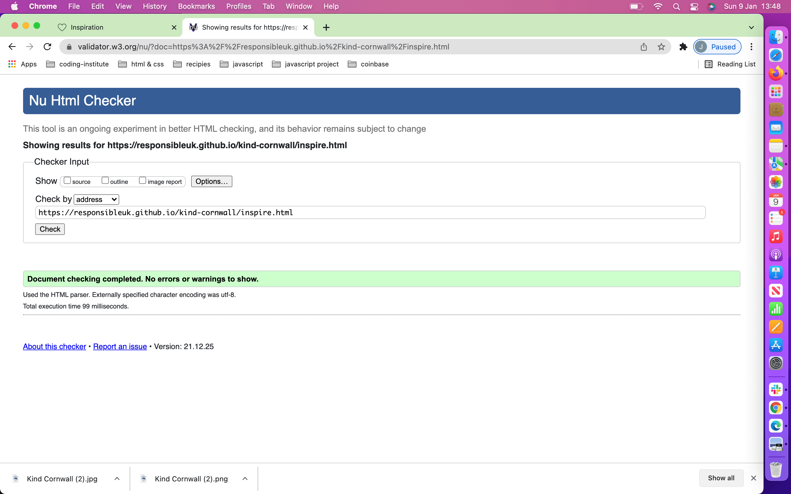
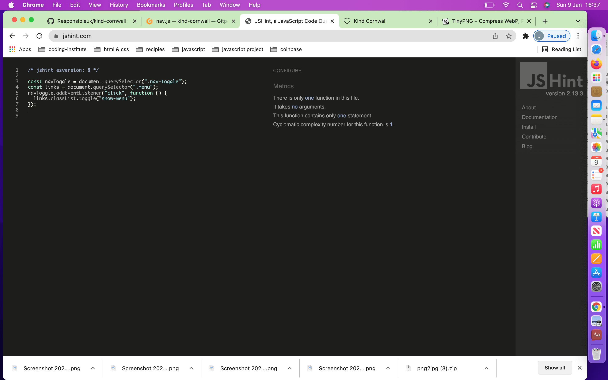
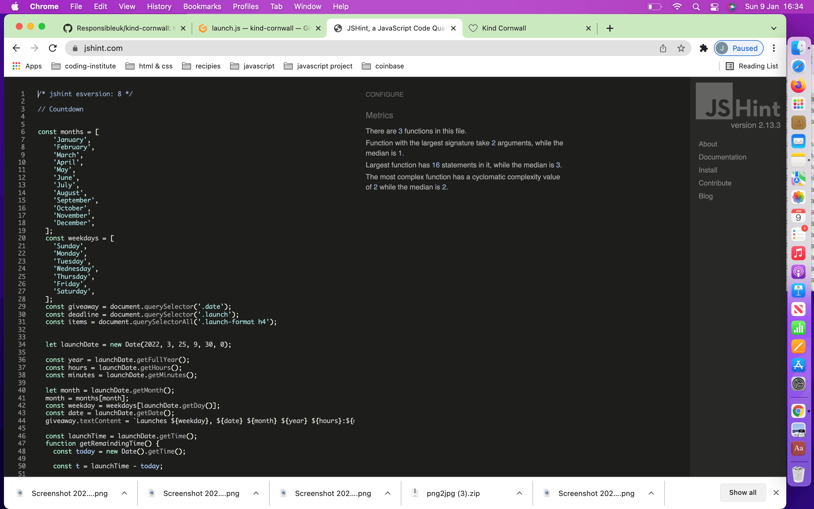
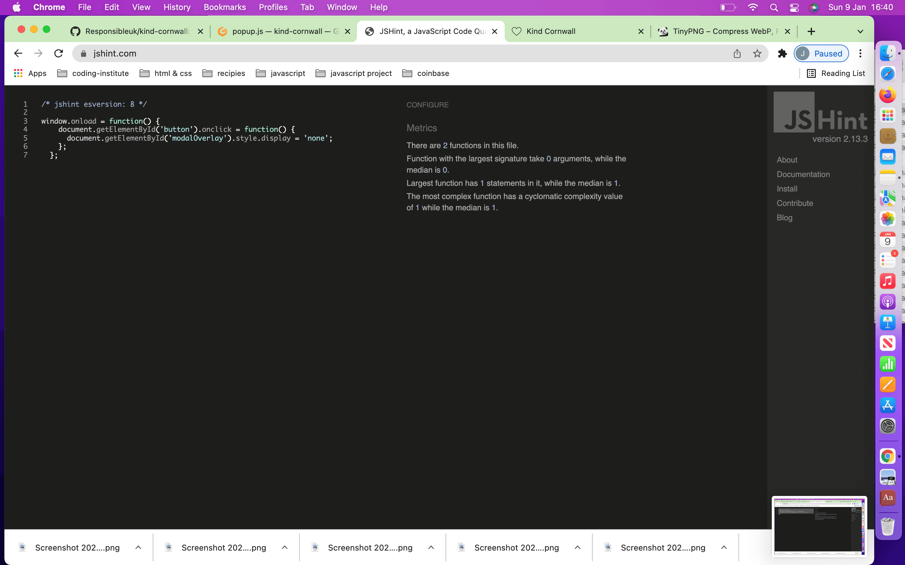
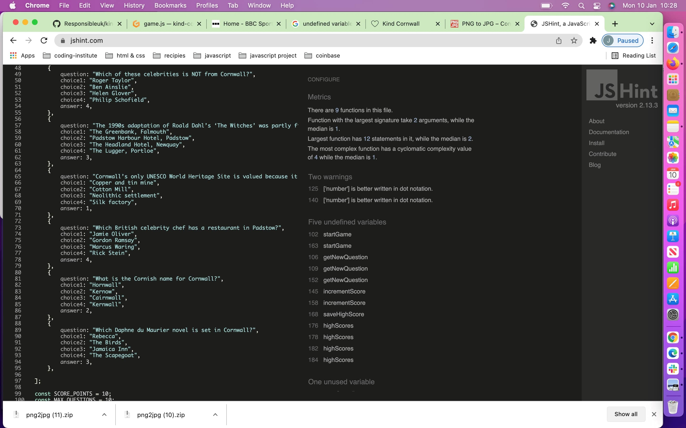
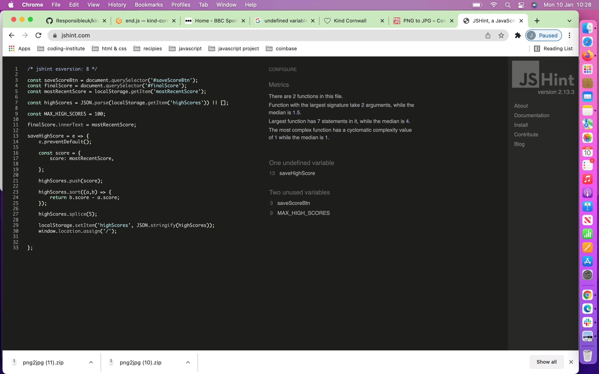
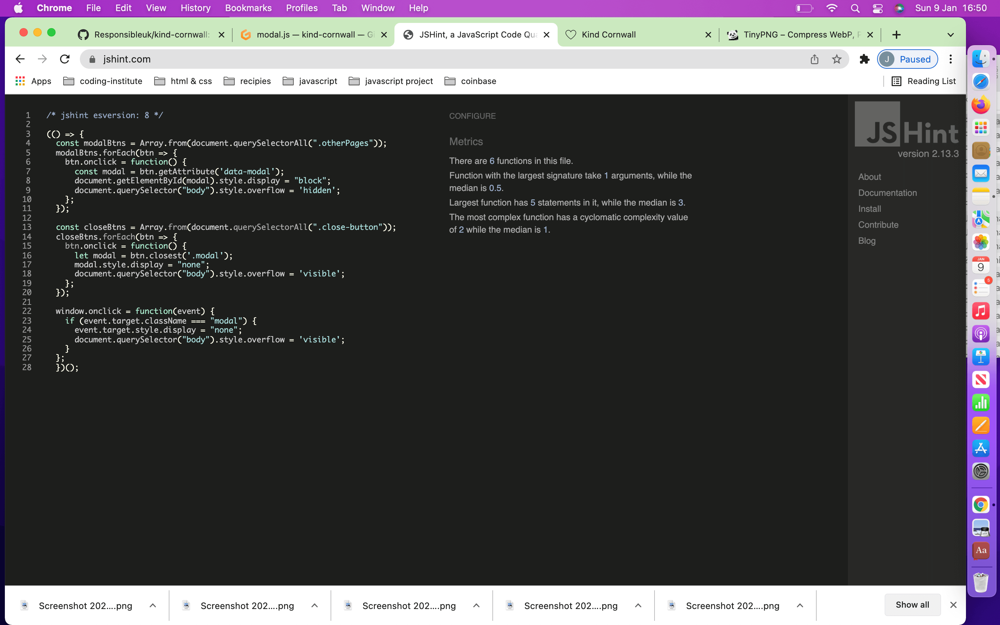

## Testing 

- __Different Browsers__

 - The site tests well on different browsers, I noticed one difference on Mozilla, see below.

- __Chrome__

 - All screenshots in README have been taken from Chrome.

- __Mozilla__

 - 

 - 

 - 

 - 

 - 

 - 

 - 

- __Edge__

 - There were no errors when testing on edge.

 - 

 - 

 - 

 - 

 - 

 - 

 - 

- __Responsiveness__

 - The site is responsive and reads well on all devices and browsers.

 - These images shows the site minimised on Chrome, Edge and Mozilla.

 - 

 - 

 - 

 - 

 - 

### Validator Testing 

- __Html__

 - 
 
 - 

 - 

 - 

 - 

 - 

 - 

- __CSS__
 
  - no errors were found when passing through the official [(Jigsaw) validator](https://jigsaw.w3.org/css-validator/validator?uri=https%3A%2F%2Fvalidator.w3.org%2Fnu%2F%3Fdoc%3Dhttps%253A%252F%252Fcode-institute-org.github.io%252Flove-running-2.0%252Findex.html&profile=css3svg&usermedium=all&warning=1&vextwarning=&lang=en#css)

 - 

- __Script__

 - 

 - 

 - 

 - 

 - 

 - 

 - 

### Unfixed Bugs

 - 6 undefined variables