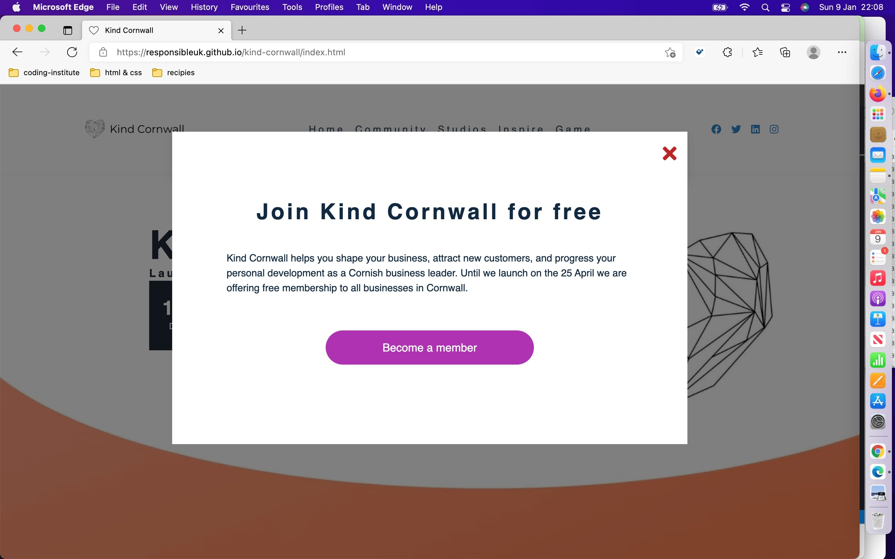
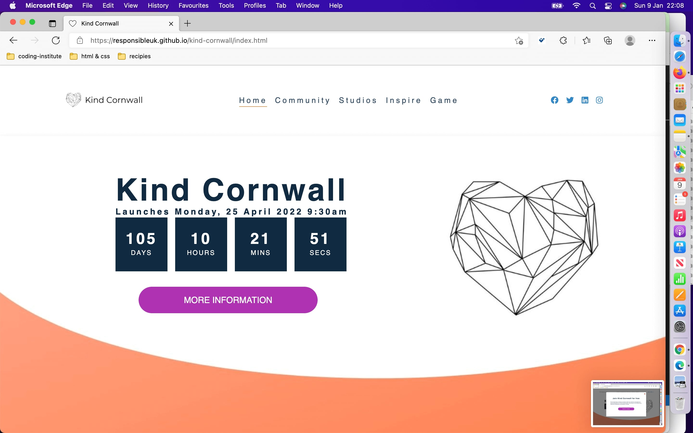

## Testing 

- __Different Browsers__

 - The site tests well on different browsers, I noticed one difference on Mozilla, see below.

- __Chrome__

 - All previous screenshots in this document have been taken from Chrome.

- __Mozilla__

 - There were no problems when testing on Mozilla.

 - 

 - 

 - 

 - 

- __Edge__

 - There were no problems when testing on edge.

 - 

 - 

 - 

- __Footer__

 - Footer is responsive and works in all browsers.

 - 

- __Responsiveness__

 - The site is responsive and reads well on all devices and browsers.

 - This image shows the site minimised on Chrome, Edge and Mozilla.

 - 

### Validator Testing 

- __Html__

- __CSS__

  - 3 errors were found when passing through the official [(Jigsaw) validator](https://jigsaw.w3.org/css-validator/validator?uri=https%3A%2F%2Fvalidator.w3.org%2Fnu%2F%3Fdoc%3Dhttps%253A%252F%252Fcode-institute-org.github.io%252Flove-running-2.0%252Findex.html&profile=css3svg&usermedium=all&warning=1&vextwarning=&lang=en#css)

 - 

### Unfixed Bugs

No bugs unfixed

## Deployment

The site was deployed to GitHub pages. The steps to deploy are as follows: 
  - In the [GitHub repository](https://github.com/Responsibleuk/kind-cornwall), navigate to the Settings tab 
  - From the source section drop-down menu, select the **Main** Branch, then click "Save".
  - The page will be automatically refreshed with a detailed ribbon display to indicate the successful deployment.

The live link can be found [here](https://responsibleuk.github.io/kind-cornwall/index.html)

## Local Deployment